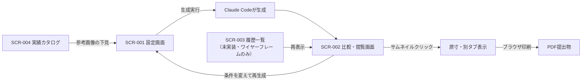

# SPEC.md

> このファイルは人間が記述する要件定義書です。
> investigator・architectが参照して調査・設計を進め、reviewer・testerが合否判定の基準として参照します。
> 曖昧な記述はブロッカーの原因になるため、各セクションを具体的に記述してください。

> **エージェント向け運用ルール:**
> - 「12. 未決事項」に依存する作業に遭遇した場合、推測で補完せずチケットを `blocked` にし、ブロッカーセクションに未決事項のID(OQ-xxx)を記載すること。
> - 機能要件は必ず要件ID(REQ-xxx)で、画面は画面ID(SCR-xxx)で参照すること。チケット・設計書には対応するIDを明記すること。
> - Should/Could要件は、Must要件がすべて `done` になるまで着手しないこと(人間が明示的に指示した場合を除く)。
> - 画面の**存在と役割**は本書「6. 画面一覧・画面遷移」が正、**レイアウト・見た目**はワイヤーフレーム(docs/wireframes/)が正とする。両者が矛盾する場合は作業を進めず人間に確認すること。

---

## 0. 文書情報・変更履歴

| 版数 | 更新日 | 更新者 | 変更概要 |
|---|---|---|---|
| v1.0 | 2026-07-07 | 研究開発部(spec-interviewにて作成・ユーザー承認済み) | 初版作成 |
| v1.1 | 2026-07-07 | 研究開発部(wireframe-genにて作成) | SCR-001・SCR-002のワイヤーフレーム作成に伴い画面一覧のパスを更新。SCR-001に「案件名」入力欄を追記(REQ-010の保存フォルダ名に必要) |
| v1.2 | 2026-07-07 | 研究開発部 | 成果物・システムの呼称を「肉付きワイヤーフレーム」→「デザインラフ」(システム名「デザインラフ・ジェネレーター」)に統一。SCR-003・SCR-004のワイヤーフレームも作成し全4画面のパスを反映 |
| v2.4 | 2026-09-05 | 研究開発部(KLK-086〜095) | ページ構成 `composition`(同一セクションの複数配置・並び順・エントリ個別設定)を REQ-005 系へ追加。1案生成でも比較画面を出し機能を同等化(REQ-008/REQ-201)。NFR-001 に生成時間の実測とタイムアウト1800秒の根拠を追記 |
| v2.3 | 2026-09-04 | 研究開発部(KLK-083) | REQ-102 を「UIのみ・生成未反映」から**配色の読み取り実装済み**へ改訂。対象は**配色だけ**とし、レイアウト構成はスクリーンショット経由に一本化（HTMLからは判定できないため）。ブリッジ初の外向き通信につき SSRF ガード（内部アドレス拒否・リダイレクト先も毎ホップ再検査）を規定。外部アクセスの可否そのものは AI利用管理責任者の確認事項 |
| v2.2 | 2026-09-04 | 研究開発部(KLK-080) | REQ-103 の後段検証を「型が変わったか」から「**その型が規約を守って作られているか**」へ拡張。§3.0（比率・min-height）／§12.1.3（masonry の充填）／§8.1（狭カラムでの横並び）／マーカー衛生を機械検査し `/status` の `warnings` で返す。**型指定の有無にかかわらず実行**する |
| v2.1 | 2026-09-04 | 研究開発部(KLK-079) | REQ-103 に**生成後の型入れ替え**を追加（`desiredType`・許可リスト検証・完了後のブリッジ側検証と `typeApplied`）。指示が守られなかったときに成功と区別して伝えることを要件に含める。**判定は「指定の型がちょうど1つ」**（旧マーカーを外し忘れて2つ残った状態は CSS が競合するため成功にしない） |
| v2.0 | 2026-09-04 | 研究開発部(KLK-078) | REQ-103 のセクション再生成で、番地の選択肢を**実ページから作る**方式へ改訂（`GET /sections`）。固定6番地の列挙と `.sec` の要素名決め打ちにより、同梱の見本3点すべてで再生成が機能していなかった不具合の修正を反映。生成後の型入れ替えは KLK-079 で対応 |
| v1.9 | 2026-09-02 | 研究開発部(KLK-069) | OQ-001(部内展開の方式)を確定。配布はローカルフォルダの手渡し方式とし、`tools/make-package.sh` で組み立てる。実績カタログの同梱可否は確認中のため既定は同梱しない |
| v1.8 | 2026-09-02 | 研究開発部(KLK-067 / KLK-068) | 主配色を palette 準拠の16カテゴリへ拡張（マルチカラー→カラフル 改名・REQ-105/106）。REQ-105 にカタログの削除機能（.trash への退避方式）を追記 |
| v1.7 | 2026-09-02 | 研究開発部(KLK-064) | REQ-106 の取り込みを2段階方式（提案→画面で承認→Python が登録）へ改訂。旧方式が非対話実行と必須確認ゲートの衝突により登録に到達しなかった不具合の修正を反映 |
| v1.6 | 2026-09-02 | 研究開発部(KLK-063) | REQ-106 に SCR-004 からの画像アップロード（D&D／ファイル選択・JPG/PNG/WebP・サーバ生成名・マジックバイト判定・保存先は catalog/.pending/ 固定）を追記。配布先の各メンバーが空のカタログから自分の実績を登録できるようにするためのパッケージ化要件 |
| v1.5 | 2026-09-02 | 研究開発部(KLK-062) | REQ-201 を「スマホ表示版の同時生成(数値指定)」から「比較画面での表示幅プリセット切替(全幅/768px/375px・CSS-only)」へ改訂。生成物が既にレスポンシブであるため二重生成を廃止した。数値の任意指定を行わない理由と、`variants:1` に幅切替が無いことを明記。SCR-001 のスマホ設定と `output.mobile` の撤去を反映 |
| v1.4 | 2026-09-02 | 研究開発部(KLK-061) | 画面と仕様の記述を実装の現実へ追従。REQ-102 を「UIのみ実装済み・生成未反映」と明記し対応予定の方式を記載。REQ-202 / SCR-003 を「未実装(Could)」と明記し、実質の履歴が `mockups/{日付}_{案件名}/` であることを追記。画面遷移図の SCR-003 にも未実装を注記 |
| v1.3 | 2026-09-02 | 研究開発部(KLK-059) | OQ-002(テイスト語彙・canonical 10種)・OQ-003(業種一覧・canonical 17区分)を確定。REQ-101 の OQ 依存注記を解消。語彙の正は CATALOG_RULES §3 に一元化し、SCR-001／SCR-004／catalog-import／catalog.json の四者一致を `tests/site/check_klk059.py` で機械検証する |

---

## 1. プロジェクト概要

業種・カラム構成・配色・テイスト・参考素材(実績画像/見本URL)を指定すると、画像のアタリ・業種に合った仮文言・スクロール出現アニメーション付きの「デザインラフ」(ワイヤーフレームとデザインモックの中間にあたるトップページのHTMLラフ)を複数案生成するシステム「デザインラフ・ジェネレーター」を構築する。第1段階は作成者本人がClaude Code上で使用する。

---

## 2. 背景・目的

現状、Webサイト提案1件あたりワイヤーフレーム作成に約4時間、デザイン案作成に約8時間(計12時間)を要している。コンテンツ配置・画像の見せ方・グローバルナビ位置・読込/スクロール時の動き・配色がワイヤー段階で決まれば、デザイン作成から**約6時間の削減**が見込める。本システムはその「決め」を高速化する。

用途は以下の2つ。

1. 新規クライアントへの提案・プレゼン前のたたき台作成
2. 制作着手前の方向性検討(複数案比較)

将来的には研究開発部のメンバー(デザイナー・プログラマー・ライター。全員CSS/コーディング経験あり・Claude Code導入予定)への展開を目指すが、それは第2段階とする(セクション11参照)。

---

## 3. 用語集

| 用語 | 定義 |
|---|---|
| デザインラフ | 本システムの成果物。ワイヤーフレームとデザインモックの中間物で、デザイン完成品ではなく、配置・配色・アタリ画像・仮文言・動きまでを表現したHTMLラフ |
| アタリ画像 | 完成品で入る写真の仮置き。標準は「配色に調和した色面+内容説明ラベル+ストック検索キーワード」(a方式)、オプションでフリー実写真(b方式) |
| 実績カタログ | 実績画像約100点+手動収集した見本サムネイルに、AIが業種・テイスト・配色等のタグを付けた索引(JSON)。生成時の参照元 |
| 生成指示書 | 設定画面(SCR-001)の入力を構造化したJSON。AIへの生成指示の正 |
| 番地ラベル | 生成モックの各セクションに振るID表示(例: MV-01)。部分再生成の指示に使う。印刷時は非表示 |
| 案 | 同一の生成指示書から作られるバリエーション(最大3案) |
| テイスト | デザインの方向性を表す語(高級感・ポップ等)。結果が濁らないよう単一選択とする |

---

## 4. ユーザー・ステークホルダー

| ユーザー種別 | 説明 | 主な操作 |
|---|---|---|
| 生成ユーザー | 第1段階: 作成者本人。第2段階(スコープ外): 研究開発部メンバー | 設定入力・生成・比較・PDF化・カタログ管理 |
| コーディング担当者 | 部内の実装担当 | 生成モックをURLで閲覧し動きを確認(生成はしない) |
| クライアント | 提案先 | PDF/画像で成果物を確認(システムには触れない) |

---

## 5. 機能要件

### Must(必須)

| ID | 要件 | 関連画面 | 失敗時の挙動・備考 |
|---|---|---|---|
| REQ-001 | 業種を選択して生成条件にできる(一覧から選択+自由入力でも指定可) | SCR-001 | 未指定なら生成を開始せず不足項目を通知。一覧の初期値はカタログ作成時に実績から起こす(OQ-003)が、自由入力があるためOQに依存しない |
| REQ-002 | カラム構成をミニ図解付きで単一選択できる(1カラム/全体2カラム・サブ左/全体2カラム・サブ右/本文のみ2カラム・サブ左/本文のみ2カラム・サブ右/3カラム)。生成は選択構成に従う。加えて生成時アニメーション(読込フェードイン・スクロール出現)のON/OFFを選択できる(既定ON・OFFで生成物は即時全表示) | SCR-001 | 未選択なら生成を開始せず不足項目を通知。「全体2カラム」はサイドバーがページ全高(メインビジュアルの横にも回る)、「本文のみ2カラム」はメインビジュアル全幅+その下の本文だけ2分割。旧値は生成側で本文のみ系へエイリアス正規化 |
| REQ-003 | 配色(メイン/サブ/アクセント/背景)を指定できる。配色ジェネレーター(palette/)の出力の貼り付け取り込みに対応 | SCR-001 | 貼り付け内容が解析できない場合は理由を表示し手動指定を促す |
| REQ-004 | 実績カタログのサムネイルから参考画像を2〜3枚選択できる | SCR-001 | 読み込めない画像は除外して続行し、除外を通知 |
| REQ-005 | デザインラフをHTMLで生成できる(コンテンツ配置・アタリ画像・グローバルナビ位置・配色適用・スクロール出現/読込アニメーション) | SCR-002 | 生成失敗時も生成指示書は保持し、再実行できる。アニメーションは生成指示書 `output.animation`(既定ON)で切替。OFFの場合は `.reveal`/`IntersectionObserver` を出力せず即時全表示(REQ-002拡張) |
| REQ-006 | アタリ画像は標準で「配色に調和した色面+内容説明ラベル+AdobeStock等で探すための検索キーワード」を表示する(a方式) | SCR-002 | キーワードが定まらない箇所は説明ラベルのみとし、その旨を明示 |
| REQ-007 | 業種に合った仮キャッチコピー・見出し・本文を生成する(「サンプルテキスト」等のダミー禁止。本番文言の文字数目安になる品質) | SCR-002 | 文言が定まらない箇所は「(要検討: ◯◯についての一文)」と明示 |
| REQ-008 | 複数案(最大3案)を一括生成し、サムネイル一覧・ボタンでの案切替・クリックで原寸を別タブ表示して比較できる | SCR-002 | 一部の案のみ失敗した場合は成功分を表示し、失敗を通知 |
| REQ-009 | 生成モックはブラウザ印刷でPDF化できる品質とする(番地ラベル等の補助表示は印刷時に自動非表示) | SCR-002 | 補助表示の印刷混入はテストで検知し差し戻し対象とする |
| REQ-010 | 生成物と生成指示書は `mockups/{日付}_{案件名}/` に自動整理し、完了後に保存先フォルダを自動で開く | - | フォルダが開けない場合は保存先パスを表示。ローカルブリッジ(§9・オプション)稼働時は「この内容で生成」押下で生成〜保存〜比較画面オープンまで自動化(ワンクリック)。非稼働時は従来どおりクリップボードコピー+手順案内 |
| REQ-011 | 実績画像・収集サムネイル・カタログ・案件名・生成物は、Git公開対象外のフォルダ(`.gitignore` 登録済み)のみに保存する | - | 公開対象パスへの保存が要求された場合は保存せず警告する |

### Should(できれば)

| ID | 要件 | 関連画面 | 備考 |
|---|---|---|---|
| REQ-101 | デザインテイストを単一選択チップで指定できる | SCR-001 | 語彙は OQ-002 で確定(canonical 10種・正は CATALOG_RULES §3)。チップの表示ラベルは生成ヒント、`data-taste`(canonical)はカタログ絞り込み用 |
| REQ-102 | 見本サイトのURLを入力し、配色の傾向を生成に反映できる | SCR-001 | **実装状況(2026-09-04・KLK-083): 配色の読み取りを実装済み**。`POST /read-colors` がページと**同一オリジンのCSS**（最大4本）から色を数え、頻度順のスウォッチと役割の下書き（メイン/サブ/アクセント/背景）を返す。画面の「この配色を使う」で既存の配色欄へ入り、人間が自由に修正できる。**AI を通さない決定的な処理**で、生成パイプラインには触れない（配色欄に値が入るだけ）。**レイアウト構成（sectionLayouts）は読み取らない**——見た目の判断が要りHTMLからは判定できないため。構成も参考にしたい場合は従来どおりスクリーンショットを実績カタログへ取り込む（収集見本24件すべてがこの方式で `colors` と `sectionLayouts` を保持している）。**SSRF ガード**: `http`/`https` のみ・資格情報つきURL拒否・ループバック/プライベート/リンクローカル/予約アドレス拒否・**リダイレクト先も毎ホップ再検査**（ブリッジは利用者の端末で動くため社内ネットワークの踏み台にしない）。取得内容は保存せず、色を返すだけ。読み取れないとき（JavaScript で描画するサイト等）は黙らず理由を返す |
| REQ-103 | 番地ラベル(例: MV-01)を指定してセクション単位で再生成できる | SCR-002 | **2026-09-04・KLK-078: 番地の選択肢を実ページから作る**（`GET /sections` が対象HTMLの番地・現在の型・選べる型を DOM 順で返す）。従来は SCR-002 に基本6番地を**固定列挙**していたが、KLK-022 以降セクション構成は指示書ごとに変わるため選択肢と実ページが食い違い、**見本3点すべてで壊れていた**（選べるのに404／実在するのに選べない）。あわせて `.sec` の要素名決め打ち（`
` のみ）を解消（`<section>`/`<nav>`/`<header>`/`<footer>` を使うページでは**全番地が404**＝機能が丸ごと死んでいた）。**2026-09-04・KLK-079: 生成後にセクションの型を入れ替えられる**（`POST /regenerate` の `desiredType`・省略時は従来どおり同じ型で作り直す）。選べる型は §12.1.2/§12.1.3 の**その番地のプール**に限り、**許可リスト**で検証する（パターン照合にしない）。**再生成の完了後、ブリッジが対象HTMLを読み直して型が実際に変わったかを検証**し、`/status` の `typeApplied` で返す（`false` のとき画面は成功と同じ見た目にしない）。ブリッジが指示し LLM が生成する経路は、守られたかを誰も見ていないと「成功したように見えて何もしていない」が起きるため（KLK-064/065/072〜076 で4回発生）。**2026-09-04・KLK-080: 検証対象を規約全般へ拡張**（§3.0 の比率と min-height・§12.1.3 の masonry 充填・§8.1 の狭カラムでの横並び・マーカー衛生）。`/status` の `warnings` で返し、**型指定の有無にかかわらず実行**する。判定できないものは黙る（fail-open） |
| REQ-104 | アタリ画像にフリー実写真を使うオプション(b方式) | SCR-001 | **メインビジュアル(MV-01)限定**。実写真の**アップロード**(ローカルブリッジ経由)＋ストック**検索リンク**(無料中心=Unsplash/Pexels/Pixabay＋Adobe Stockは探索用)。**URL直接入力は将来**。アップロード画像は出力フォルダへ**相対同梱**し自己完結(外部httpURLは埋め込まない)。他アタリ枠は常にa方式。未供給/読込失敗はMVもa方式へフォールバック。通信必須。イメージ違いは許容 |
| REQ-105 | 実績カタログをタグ(業種・テイスト・配色)で絞り込みながら閲覧できる | SCR-004 | 実運用後にMust昇格の可能性あり。**2026-09-02・KLK-068: カタログから登録を取り消せる**（SCR-004 の各カードの 🗑 → 確認モーダルで対象を目視 → `POST /catalog-delete`）。**画像は削除せず `catalog/.trash/` へ退避する**（`catalog/` は Git 管理外で復元できないため、誤操作のリスクが登録と非対称。自動削除はしない）。`catalog.json` は削除後の全体を `validate_catalog` に通してから一時ファイル→`os.replace` で原子的に更新し、失敗時は退避を巻き戻す |
| REQ-106 | 新規画像(自身の実績+手動収集の見本サムネイル)を取り込み、AIが自動タグ付けしてカタログ登録できる | SCR-004 | 取込先はREQ-011のフォルダに限る。**2026-09-02・KLK-063: SCR-004 のドロップゾーンから直接アップロードできる**（ドラッグ&ドロップ／クリックでファイル選択・複数可・JPG/PNG/WebP・1枚8MBまで）。保存名は**サーバ生成の安全名**（`pnd-<uuid>.<ext>`）でクライアント由来の名前をパスに使わない。画像判定は**マジックバイト**（Content-Type・拡張子は信用しない）。保存先は `catalog/.pending/` に固定し `catalog/` の外へは書かない。従来どおりフォルダへ直接コピーする運用も併用できる。登録の確定は従来どおり Claude Code のチャットでの人間承認後のみ。**2026-09-02・KLK-064: 取り込みを2段階方式へ**（①AI がタグ付け案を `catalog/.pending/{jobId}.proposal.json` に書き出す ②人間が SCR-004 の画面で確認・修正・除外 ③承認分だけをブリッジ(Python)が `validate_catalog` を通してから登録）。**AI は `catalog.json` を書かない**。旧方式はブリッジが `claude -p`(非対話)を起動しており、スキルの必須確認ゲートを満たせず**一度も登録に到達していなかった**（本チケットで修正）。チャットから `/catalog-import` を直接実行する対話モードは従来どおり利用できる |

### Could(余裕があれば)

| ID | 要件 | 関連画面 | 備考 |
|---|---|---|---|
| REQ-201 | 比較画面で表示幅を切り替え、スマホでの見え方を確認できる | SCR-002 | **2026-09-02・KLK-062 で方式を改訂**（旧: スマホ表示版の同時生成・ブラウザ幅の数値指定対応）。生成物は NFR-002 / DRAFT_RULES §8 により `@media (max-width: 640px)` を必ず持つ＝**すでにレスポンシブ**のため、スマホ用HTMLを別ファイルで二重生成せず、比較画面 `compare.html` で iframe の表示幅を切り替える方式にした。**プリセット3種（全幅 / 768px / 375px）**。生成物のブレークポイントは 640px の1つだけなので、375px=モバイル版レイアウト・768px=PC版が狭まった状態・全幅=通常、でとりうる見え方を網羅できる。**数値の任意指定は行わない**（compare.html に JS が必要になり DRAFT_RULES §13「JS は原則不要」に反するため。任意幅はブラウザの開発者ツールで代替可能）。実装は CSS-only（第2の隠しラジオ群 `name="vw"`）。**`variants:1` は `compare.html` を作らないため幅切替も無い**（standalone はレスポンシブなのでブラウザ幅を変えて確認する）。SCR-001 の「スマホ表示版も同時に生成する」設定と生成指示書の `output.mobile` は撤去済み |
| REQ-202 | 生成履歴の保存・見返し | SCR-003 | **実装状況(2026-09-02・KLK-061): 未実装(Could・未着手)**。`draft-gen/` に履歴画面は無く、履歴を保存する処理も持たない。実質の履歴は REQ-010 の保存先 `mockups/{日付}_{案件名}/` (フォルダ名に日付と案件名が入り、`instruction.json` に生成条件が残る。Git除外・ローカルのみ)。実装する場合はブリッジに `mockups/` のフォルダ一覧を返すエンドポイントを足す想定 |

---

## 6. 画面一覧・画面遷移

### 画面一覧

| ID | 画面名 | 目的 | 主な要素 | 対応要件 | アクセス可能なユーザー | ワイヤーフレーム |
|---|---|---|---|---|---|---|
| SCR-001 | 設定画面 | 生成指示書を作る | 案件名・業種選択・カラム図解ラジオ・テイストチップ・配色入力(カラーピッカー/直接入力/配色ジェネレーター起動)・実績サムネイルピック(業種連動・拡大モーダル)・URL入力・案数選択・生成実行 | REQ-001〜004, 101, 102, 104, 201 | 生成ユーザー | docs/wireframes/SCR-001-settings.html |
| SCR-002 | 比較・閲覧画面 | 生成案の比較・確認・提出準備 | 案サムネイル一覧・ボタン切替・原寸別タブ表示・番地ラベル・印刷対応 | REQ-005〜009, 103 | 生成ユーザー・コーディング担当者 | docs/wireframes/SCR-002-compare.html |
| SCR-003 | 履歴一覧画面(Could)**【未実装】** | 過去の生成の見返し | 日付・業種・設定要約・再表示リンク | REQ-202 | 生成ユーザー | docs/wireframes/SCR-003-history.html **(ワイヤーフレームのみ。実画面は未作成。実質の履歴は `mockups/{日付}_{案件名}/`)** |
| SCR-004 | 実績カタログ画面(Should) | 参照素材の閲覧・追加 | タグ絞り込み・サムネイル一覧・画像取り込み(自動タグ付け) | REQ-105, 106 | 生成ユーザー | docs/wireframes/SCR-004-catalog.html |

### 画面遷移図

---

## 7. エラーハンドリング・異常系方針

- 生成前バリデーション: 必須項目(業種・カラム構成・配色)が欠けている場合は生成を開始せず、不足項目を列挙して通知する
- 外部参照の失敗(見本URL・参考画像・フリー写真): 失敗した要素のみ除外して生成を続行し、除外内容を必ず通知する(全体を止めない)
- 生成失敗: 生成指示書(JSON)は常に保存されており、入力し直しなしで再実行できる
- 想定外エラー: エラー内容を表示し、入力内容・生成指示書を失わない

---

## 8. 非機能要件

| ID | 項目 | 要件 | 検証方法 |
|---|---|---|---|
| NFR-001 | 生成時間 | 3案一括生成が概ね10分以内(品質優先。厳格な上限ではなく目安)。**2026-09-05・KLK-095 実測**: 同じ規模(本文6〜7セクション)でも **262〜847秒(4.4〜14.1分)** とばらつき、セクション数との相関は見えない(生成そのもののばらつきが支配的)。**ブリッジのハードタイムアウトは 1800秒(30分)**。900秒では最長実測847秒に対し余裕6%しかなく、**正常な生成が失敗扱いになる**余地があったため延長した。上限自体は残す(`claude -p` が0%CPUのまま34分無反応になる事象を観測済み・KLK-079) | 人間が確認 |
| NFR-002 | 対応ブラウザ | Chrome最新版(macOS / Windows) | 人間が確認 |
| NFR-003 | 印刷品質 | A4での印刷/PDF化でレイアウトが破綻せず、補助表示(番地ラベル等)が印刷に含まれない | 自動テスト(印刷CSSの検証)+人間が確認 |
| NFR-004 | 機密保持 | 実績画像・収集サムネイル・カタログ・生成物・案件名がGit管理対象に含まれない | 自動テスト(`git check-ignore` で対象フォルダの除外を検証) |
| NFR-005 | 外部依存なし | 設定画面・比較画面・生成モックは外部CDN依存なしでオフライン表示できる(REQ-104使用時を除く) | 自動テスト(HTML内の外部URL参照検査) |

> **NFR-005 補足(REQ-104・KLK-020)**: REQ-104 の実写真はアップロード画像を出力フォルダへ**相対同梱**(`assets/mv.<ext>`)するため、
> **生成物自体は外部CDN依存ゼロ・オフライン閲覧可**を維持する。ストック写真の検索リンクは設定画面(SCR-001)から別タブで開く
> 探索用の導線のみで、**生成物(デザインラフHTML)には含めない**(外部httpURLの埋め込みは行わない)。
| NFR-006 | テスト品質 | 単体テストは既存 `tests/`(Python)方式に従い、リポジトリのQuality Gateを満たす | tester(自動) |

---

## 9. 技術的制約

> 本プロジェクトはローカル完結のツールでありWebアプリ標準構成の前提(サーバー・DB・API)から大きく外れるため、標準構成 v1.0 は適用しない。以下はユーザーが承認した段階方式(第1段階)の構成であり、★はユーザー明示指定・承認項目。

- ★形態: 静的HTML+CSS+vanilla JavaScript(ビルド不要・単一ファイル・外部依存なし)。既存の配色ジェネレーター(`palette/index.html`)と同型
  - (オプション・第1段階の個人利用向け) ローカルブリッジ(`draft-gen/bridge.py`・Python標準ライブラリのみ・`127.0.0.1` 限定)を併用すると、SCR-001の「この内容で生成」ワンクリックで `/draft-generate` をヘッドレス実行し比較画面(または1案)を自動表示できる。**ブリッジ非稼働でも純静的HTML単体でフォールバック(クリップボード+手順案内)で動作し、外部依存なしの原則を維持する**(KLK-010)
- ★生成エンジン: Claude Code(スラッシュコマンド化。AI APIの個別契約・サーバー・データベースは使わない)
- データ保持: ファイルベース(画像+カタログJSON+生成指示書JSON+生成HTML)。DB不使用
- テスト: Python 3(既存 `tests/` の方式に準拠)
- 実績画像等の格納先: リポジトリ内のGit除外フォルダ(パスは設計時に確定。`.gitignore` への登録を必須とする)
- 第2段階(部内展開)の基盤・認証: 未決定(OQ-001参照)
- 禁止事項: 有料ライセンスライブラリの導入、外部CDNへの依存、実績画像の公開対象パスへの配置

---

## 10. データ・外部インターフェース要件

### 取り扱いデータ

| データ | 機密区分 | 保持期間 | 備考 |
|---|---|---|---|
| 実績画像(約100点) | 社外秘(クライアント名等を含む) | 無期限 | Git公開対象外フォルダのみ。リポジトリ公開設定でも流出しないこと(REQ-011) |
| 手動収集の見本サムネイル | 第三者著作物 | 無期限 | 社内の参考目的のみ。公開・再配布・そっくり再現の材料にしない |
| 実績カタログ(タグJSON) | 社外秘に準ずる | 無期限 | 画像と同じ除外フォルダに置く |
| 案件名・生成モック・生成指示書 | 社外秘の可能性が高い | 無期限 | 同上(`mockups/` も除外対象) |

### 外部インターフェース

| 連携先 | 用途 | 認証方式 | 環境変数名 |
|---|---|---|---|
| 見本サイトURL(手動入力) | 傾向の読み取り(REQ-102) | なし | - |
| フリー写真サービス(Unsplash等) | アタリ実写真オプション(REQ-104) | なし(APIキー不要の範囲) | - |

シークレット(APIキー等)は本システムでは使用しない。

---

## 11. スコープ外(明示的な除外事項)

- 部内展開(第2段階): Webアプリ化・ID/PW認証・複数人同時利用・実績画像フォルダのアクセス制御は今回作らない(OQ-001として検討のみ継続)
- クライアントが直接システムを操作する機能(クライアントはPDF/URL閲覧のみ)
- 本番用コードの生成(生成モックはたたき台であり、WordPress組み込み等の納品コーディングの雛形にしない)
- ギャラリーサイト(muuuuu.org / choooodoii.com / sankoudesign.com)の自動巡回・自動収集(参考は実績+手動収集サムネイル+手動入力URLに限定。ギャラリーサイトはテイスト語彙の人間による参考にとどめる)
- スマートフォンアプリ(Webブラウザのみ。REQ-201はスマホ「表示の確認」であり別物)

---

## 12. 未決事項(Open Questions)

| ID | 事項 | ステータス | 決定内容 |
|---|---|---|---|
| OQ-001 | 第2段階(部内展開)の方式 — GitHub経由等の共有方法・ID/PW認証・実績画像フォルダの保護。社内エンジニアと相談 | **方式は確定(2026-09-02・KLK-069)／カタログ同梱の可否は確認中** | **配布方式=ローカルフォルダの手渡し**（Git 経由ではない）。`tools/make-package.sh` で必要なファイルだけを組み立て、受け取った人はフォルダを任意の場所へ置いて `draft-gen/起動.command` を実行する。Webアプリ化・ID/PW認証は行わない（スコープ外・§11）。本体は約2MB。**実績カタログ（社外秘32件＋第三者著作物24件・345MB）の同梱可否は AI利用管理責任者の確認待ち**のため、スクリプトの既定は**同梱しない**とし、`--with-catalog` を明示したときだけ含める（安全側の既定）。確認が済むまで、配布物にカタログは入らない |
| OQ-002 | テイスト選択肢の語彙一覧(muuuuu.orgの分類を参考にユーザーが確定) | **確定(2026-09-02・KLK-059)** | canonical 10種= シンプル / ナチュラル / 高級感 / ポップ / 和風 / かっこいい / レトロ / かわいい / アート / ダーク。正は `.claude/skills/catalog-import/templates/CATALOG_RULES.md` §3(各テイストの配色・レイアウト方向性、`高級感`と`ダーク`の判別基準を併記)。SCR-001 は**表示ラベル(`data-label`・生成ヒント)**と**canonical(`data-taste`・絞り込み)**を分離し、表示ラベルは canonical より多くてよい(現行11ラベル→10 canonical。`先進的・シャープ`は`かっこいい`へ) |
| OQ-003 | 業種一覧の初期リスト(実績100点のタグ付け結果から起こしてユーザーが確定) | **確定(2026-09-02・KLK-059。実体は KLK-032 で制定済み)** | canonical 17区分。正は `.claude/skills/catalog-import/templates/CATALOG_RULES.md` §3。SCR-001(業種select)・SCR-004(業種フィルタチップ)・catalog-import・`catalog.json` の四者が**文字列完全一致**(全角／半角スラッシュに注意)。一覧に無い業種は自由入力で指定でき、受け皿は`その他・団体/NPO` |

---

## 13. 成功基準

- Must要件(REQ-001〜REQ-011)のすべてが受け入れ基準を満たし `done` になっていること
- Must要件に対応する画面(SCR-001, SCR-002)がワイヤーフレームどおりに実装されていること
- 実案件1件で使用し、従来12時間(ワイヤー4h+デザイン8h)の工程から約6時間の削減が確認できること(人間が確認)
- すべての非機能要件(NFR-001〜NFR-006)が「検証方法」欄の方法で確認済みであること
- 単体テストのカバレッジがQuality Gate基準を満たしていること

---

## 14. 参考資料

- 配色ジェネレーター: `palette/index.html`(REQ-003の貼り付け取り込み元。出力形式はこのファイルが正)
- デザインギャラリーサイト(テイスト語彙の人間による参考のみ・自動収集禁止): https://muuuuu.org / https://choooodoii.com / https://sankoudesign.com
- 実績画像・収集サムネイル: Git除外フォルダに配置(パスは設計時に確定し、本書セクション9と `.gitignore` を更新すること)
